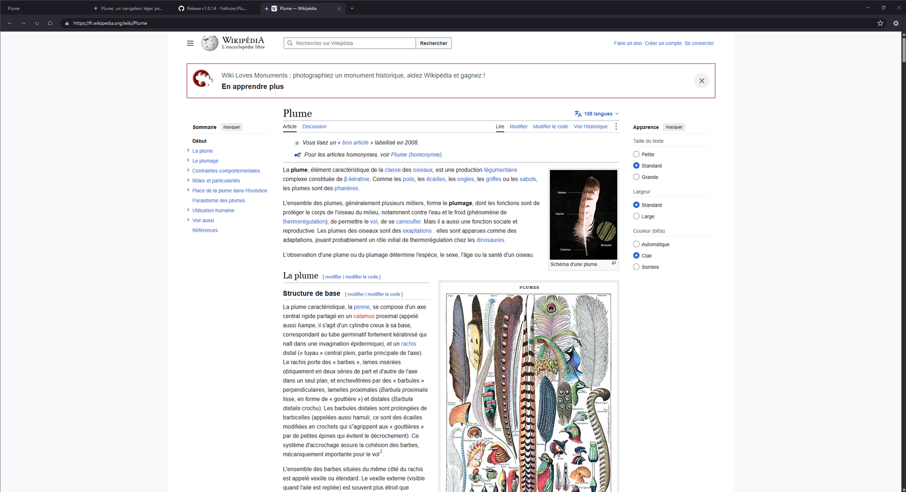
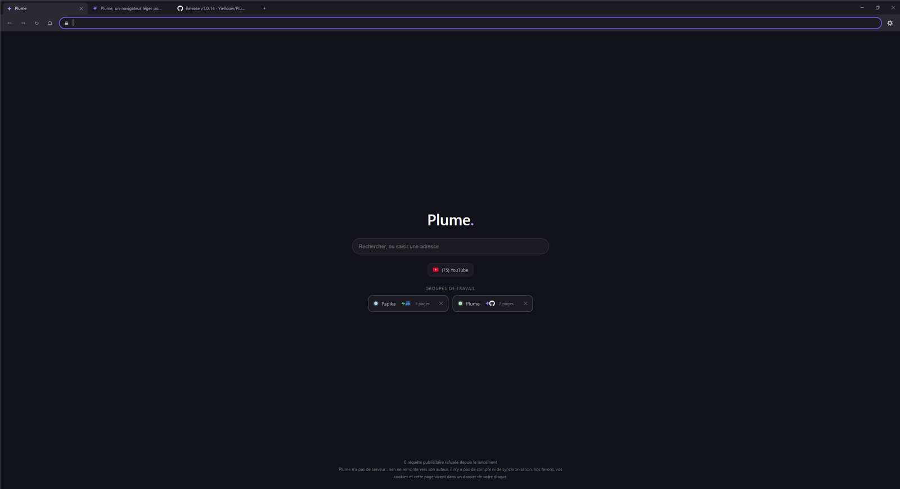
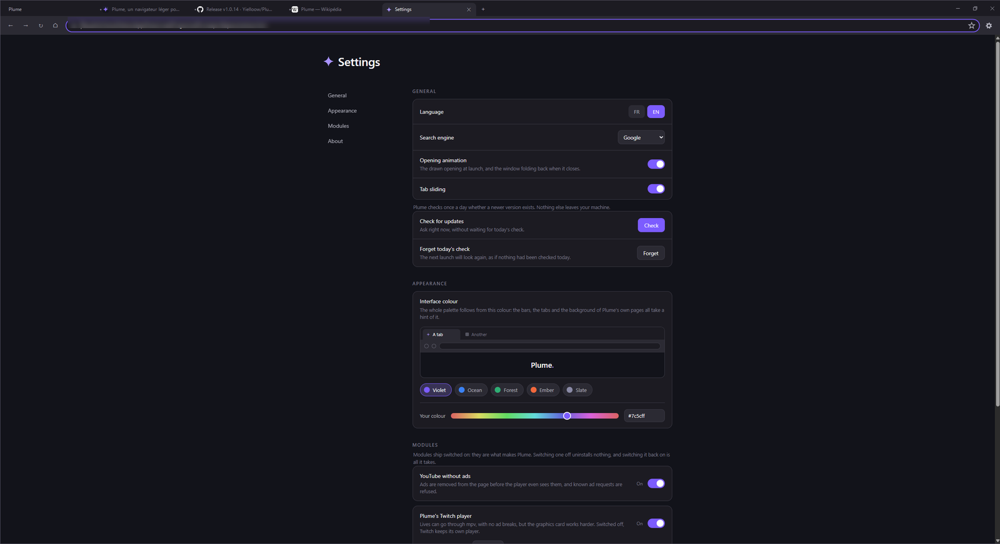

# Plume

Un navigateur léger pour Windows. English: [README.md](README.md)

Plume est un navigateur de bureau bâti sur WebView2, le moteur de rendu que
Windows porte déjà. Il garde pour lui la fenêtre, les onglets et le dessin, et
ne demande au moteur que les pages. Il en résulte un navigateur qui tient en
quelques centaines de mégaoctets au lieu de quelques gigaoctets, et qui
n'envoie rien nulle part.

[Télécharger la dernière version](https://github.com/Yielloow/Plume/releases/latest)
 ·  [Site](https://yielloow.github.io/Plume/)  ·
[Journal des versions](CHANGELOG.fr.md)



| La page d'accueil | Les paramètres |
|---|---|
|  |  |

## Ce que ça donne au compteur

Une capture du Gestionnaire des tâches, prise par une utilisatrice de Plume
pendant qu'un live Twitch y tournait :

| | Processeur | Mémoire |
|---|---|---|
| Plume.exe | 0,5 % | 118,9 Mo |
| Brave Browser | 30,7 % | 708,6 Mo |

Le moteur de rendu de Plume, WebView2, tourne dans son propre processus et
Windows le compte à part : sur une autre capture, il était à 0 % et 275,5 Mo.
Le chiffre honnête pour Plume avec une page ouverte est donc la somme des
deux, et il reste bien en dessous de ce que coûte un navigateur complet. Les
deux captures sont sur le [site](https://yielloow.github.io/Plume/).

## Ce qu'il fait

- **Onglets, barre de favoris, groupes de travail.** Un clic droit sur un
  onglet le range dans un groupe ; un clic sur la page d'accueil rouvre tout
  le groupe.
- **Onglets en veille.** Ceux que vous ne regardez pas sont gelés et rendent
  leur mémoire. Y revenir les retrouve intacts, et un onglet qui joue du son
  n'est jamais endormi.
- **YouTube sans publicité.** Les publicités sont retirées de la page avant
  même que le lecteur ne les voie, et les requêtes publicitaires connues sont
  refusées. YouTube garde son lecteur, plein écran compris.
- **Twitch, à votre choix.** Le lecteur de Twitch par défaut, léger pour la
  carte graphique. Ou celui de Plume, mpv alimenté par streamlink, qui saute
  les coupures publicitaires mais demande plus au processeur graphique. Un
  bouton dans la barre d'adresse passe de l'un à l'autre.
- **Une couleur à vous.** Toute la palette se déduit d'une seule couleur : les
  barres, les onglets, l'ouverture dessinée, l'icône de la fenêtre, la barre
  du lecteur vidéo et les pages de Plume.
- **Fenêtre privée.** Ni historique, ni cookies, ni onglets gardés.
- **Les services de streaming fonctionnent.** Widevine voyage avec le
  runtime WebView2, donc le contenu protégé se lit : Netflix est testé et
  fonctionne. Avec le plafond de 720p que tous les navigateurs subissent
  hors Edge.
- **Mises à jour en un clic.** Plume vérifie une fois par jour, vous le dit,
  et installe sur votre accord.

Les trois premiers sont des modules que la page des paramètres permet de
couper, sans rien désinstaller.

## Rien ne quitte votre machine

Il n'y a ni serveur, ni compte, ni synchronisation, ni télémétrie. Favoris,
historique, cookies et page d'accueil sont des fichiers dans un dossier de
profil sur votre disque ; le supprimer suffit à tout oublier. La seule
requête que Plume fait de lui-même est la vérification quotidienne des mises à
jour, et elle se coupe.

## Installer

Windows 10 (1809) ou 11, 64 bits. Téléchargez l'installeur depuis les
[releases](https://github.com/Yielloow/Plume/releases/latest) et lancez-le.
Rien d'autre à installer : le runtime WebView2 est déjà sur Windows, et mpv
voyage avec Plume.

**Windows va se plaindre, c'est normal.** Plume n'est signée par aucun
certificat : il en coûte plusieurs centaines d'euros par an, et c'est un
projet gratuit. Windows ne connaît donc pas l'éditeur et affiche la fenêtre
bleue « Windows a protégé votre ordinateur ». Cliquez sur *Informations
complémentaires*, puis *Exécuter quand même*. L'empreinte SHA-256 de chaque
version est publiée à côté du téléchargement, pour vérifier que le fichier que
vous avez est bien celui qui a été publié :

```powershell
Get-FileHash .\Plume-1.0.20-installeur.exe -Algorithm SHA256
```

## Construire soi-même

Il faut Python 3.10 (64 bits), les dépendances, et un `mpv.exe` dans
`outils-externes/`.

```powershell
pip install -r requirements.txt
python outils\construire.py
```

La construction écrit `..\Plume-paquet\Plume-<version>-installeur.exe`, un
dossier portable à côté, et met à jour `docs/version.json`, le manifeste que
Plume interroge pour savoir si une version plus récente existe.
`python outils\publier.py` vérifie que tout concorde avant une publication.

## Ce que Plume n'est pas

Autant le dire franchement.

- **Windows seulement.** Plume est bâtie sur WebView2 et sur le gestionnaire
  de fenêtres de Windows. Il n'y a pas de version Linux ni macOS, et il n'en
  est pas prévu.
- **Pas d'extensions tierces.** Les modules sont écrits dans Plume.
- **Un seul mainteneur.** Les signalements sont les bienvenus, les réponses
  peuvent tarder.
- **Pas un outil d'anonymat.** Rien ne quitte votre machine, mais votre
  fournisseur d'accès voit toujours passer votre trafic, et les sites que vous
  visitez vous voient toujours.

## Contribuer

Un signalement de bug avec les étapes pour le reproduire est ce qu'on peut
envoyer de plus utile. Pour du code, ouvrez d'abord une issue avant un gros
changement : Plume a des idées arrêtées sur la façon dont elle est écrite, et
mieux vaut en convenir avant. Le code et ses commentaires sont en français.

## Licence

[GPL-3.0](LICENSE). Les composants tiers et leurs licences sont listés dans
[TIERS.md](TIERS.md).
